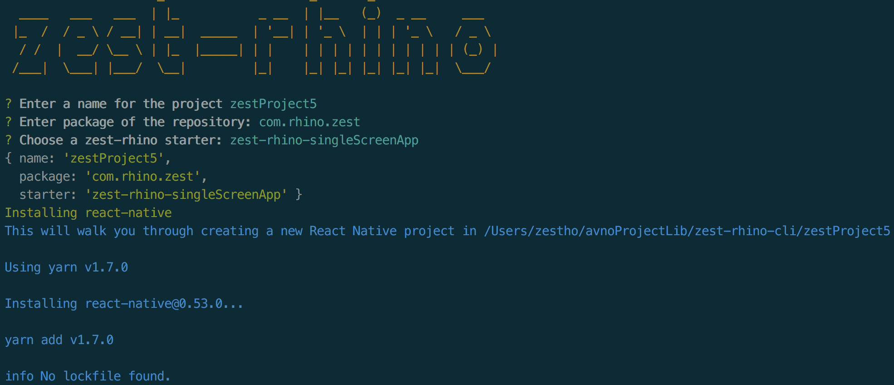

# zest-rhino-cli  

### CLI tool to create starter project combined with reat-native, react-native-navigation, mobx...  

  
## Installation  
`npm install -g zest-rhino-cli`  

## Execuatino  
`zest-rhino`  

## Todo  
- [x] starter - zest-rhino-singleScreenApp
- [ ] starter - zest-rhino-tabBasedApp
- [ ] packageName for ios
- [ ] packageName for android
- [ ] Certification for ios
- [ ] Certification for android  